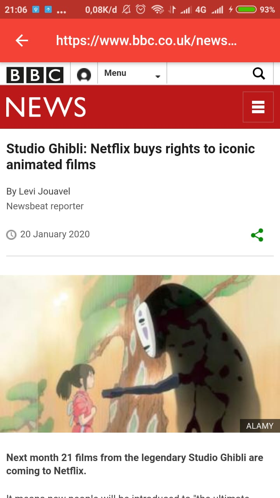

<h1 align="center">News App</h1>
<p align="center">
  
</p>
<p align="center">
  Built with <b>Flutter</b>.
</p>
## Table of Contents

- [Introduction](#introduction)
- [Features](#features)
- [Requirements](#requirements)
- [Usage](#usage-for-development)
- [Screenshots](#screenshots)
- [Release APK](#release-apk)
- [Contributors](#contributors)

## Introduction
<b>News App</b> is a mobile application where we can see list of news source around the world and we can choose one of these news list to see a list of articles from that source, then when we click the article we can read that article.

## Features
* Pick the source of news
* See a list of articles from one source
* Search a article
* Read the article on Web View

## Requirements
* [`flutter`](https://flutter.dev/docs/get-started/install)
* [`API Key from News API`](https://newsapi.org/docs/get-started)
* [`News App`](https://github.com/AdmiralYuuShi/News-App-Flutter)

## Usage for development
1. Open your terminal or command prompt
2. Type `git clone https://github.com/AdmiralYuuShi/News-App-Flutter.git`
3. Open the folder and type `flutter pub get` for install dependencies
4. Create .env file on root project folder and add following :
```
NEWS_API_KEY=[your News API key]
```
5. On Visual Studio Code, Press f5 for run this app on debug mode. ***Make sure your device is connected with debugging mode***.

## Screenshots
<div align="center">
    
    
    
    
</div>

## Release APK
<a href="https://drive.google.com/open?id=13Do7d9jYt4DNmAqvflLDvu-NwB3uGE5L">
  
</a>

## Contributors
<center>
  <table>
    <tr>
      <td align="center">
        <a href="https://github.com/AdmiralYuuShi">
          <sub><b>Hapid Moch Jamil (Admiral YuuShi)</b></sub>
        </a>
      </td>
    </tr>
  </table>
</center>
